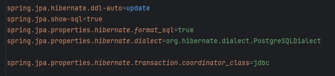
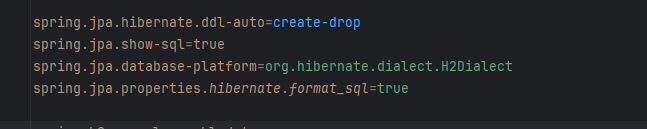
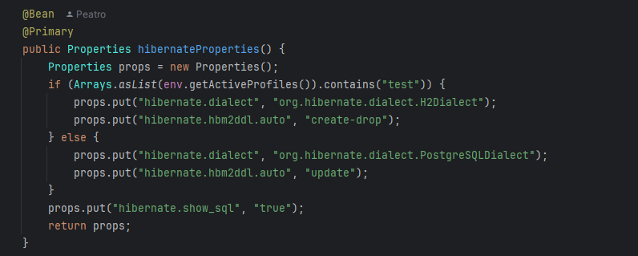

# Spring_Hibernate_Maven

> Maven-проект на базе Sring Boot, с реализацией CRUD-репозитория через Hibernate

>Использованные зависимости
>
> Lombok
>
> Docker Compose Support
>
> JDBC API
>
> Spring Data JPA
>
> H2 Database
>
> PostgreSQL Driver
>
> CycloneDX SBOM support

> Настройки Hibernate для рабочего приложения

>Настройки Hibernate для тестов
> 

Для запуска проекта:
-
- Клонируйте репозиторий
- Соберите проект Maven (mvn clean install)
- Для запуска приложения потребуется установленный Docker
- Запустите проект с помощью Docker (docker-compose up --build)
- Результатом выполнения будет поднятая БД PosetgreSQL и два добавленных пользователя в таблицу в БД
- H2 база данных подлючается для тестов автоматически с помощью тестового профиля
- Postgres запускается вместе с основным приложением ()